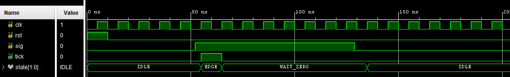
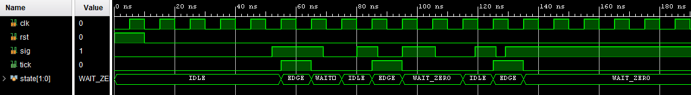
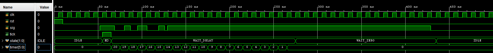

# Схема за формиране на единични импулси

Интерфейс
```
  input clk, rst, sig,
  output logic tick
```
При нарастващ фронт на входа `sig`, изходът `tick` преминава във високо нивo и остава в него за един период на такта `clk`.

`edge_detector.sv + edge_detector_test1.sv`


Ако сигналът `sig` се изработва от механичен контакт, може да се наблюдават няколко прехода при затваряне на контакта. Това ще доведе до изработване на няколко единични импулса.

`edge_detector.sv + edge_detector_test2.sv`


Въвеждането на "интервал на нечувствителност" след откриване на преход ще премахне излишните единични импулси.

`edge_detector_delay.sv + edge_detector_test2.sv`
