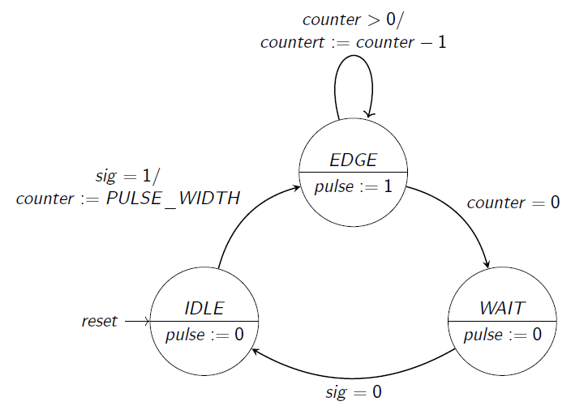
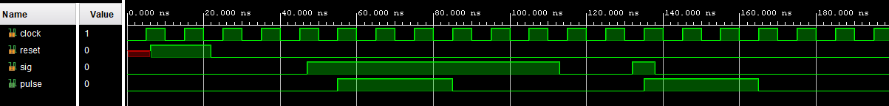
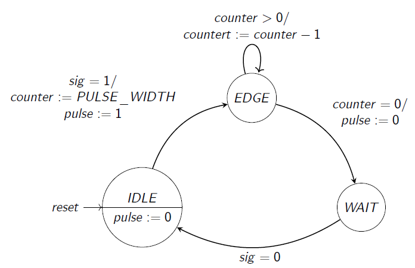
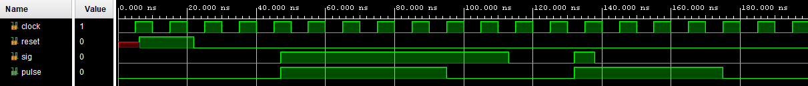

# Синхронизация на асинхронни сигнали

При нарастващ фронт на входния сигнал sig, схемата изработва сигнал pulse, който остава в “1” за определен брой периоди на тактовия сигнал.

Използва се за синхронизиране на входни сигнали с такта на последователни схеми.

## Диаграма на състоянията - автомат на Moore

## Модел
[Mодел pulse_fsm_moore.sv](pulse_fsm_moore.sv)

[Тест pulse_fsm_moore_test.sv](pulse_fsm_moore_test.sv)

## Симулация

## Диаграма на състоянията - автомат на Mealy

## Модел
[Mодел pulse_fsm_mealy.sv](pulse_fsm_mealy.sv)

[Тест pulse_fsm_mealy_test.sv](pulse_fsm_mealy_test.sv)

## Симулация

