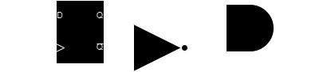
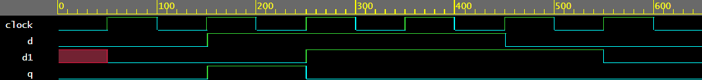
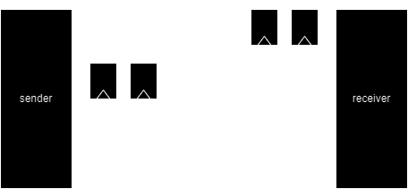

# Предаване на данни между домейни с не-синхронизирани тактови сигнали
Data transfer between mutually asybchronous clock domains.

Схемите, които осигуряват надеждно предаване на данните между два тактови домейни се наричат синхронизатори (synchronizers).

## Детектор на нарастващ фронт
Един от елементите на синхронизатора е детектора на нарастващ фронт. При наличие на нарастващ фронт на входния сигнал, тази схема изработва единичен импулс на изхода си.

[shot.sv](shot.sv)

## Синхронизатор с два тригера

