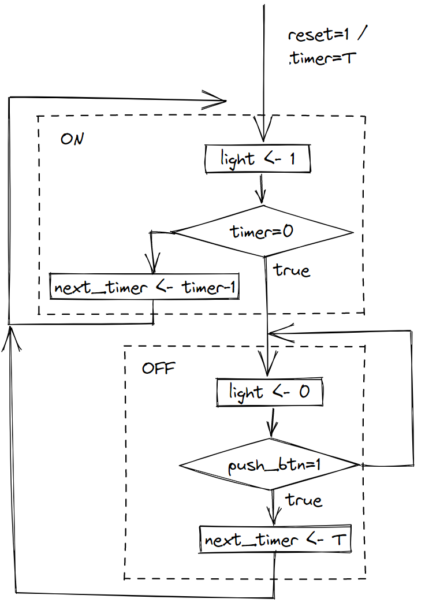

# Автомат за стълбищно осветление

## Спецификация

Входове: clock, reset, push_btn
Изходи: light

При `push_btn = 1`, изходът `light` преминава във високо нивo и остава в него за T периода на `clock`.

## Диаграма на състоянията


## Структура


## ASMD Диаграма


## Модел
[Mодел timer_light.sv](timer_light.sv)

[Tест timer_light_test.sv](timer_light_test.sv)

## Симулация


```
run -all
  0ns push_btn=0 light=1 state= ON timer=29
  1ns push_btn=0 light=1 state= ON timer=28
  3ns push_btn=0 light=1 state= ON timer=27
  5ns push_btn=0 light=1 state= ON timer=26
  7ns push_btn=0 light=1 state= ON timer=25
  9ns push_btn=0 light=1 state= ON timer=24
 11ns push_btn=0 light=1 state= ON timer=23
 13ns push_btn=0 light=1 state= ON timer=22
 15ns push_btn=0 light=1 state= ON timer=21
 17ns push_btn=0 light=1 state= ON timer=20
 19ns push_btn=0 light=1 state= ON timer=19
 21ns push_btn=0 light=1 state= ON timer=18
 23ns push_btn=0 light=1 state= ON timer=17
 25ns push_btn=0 light=1 state= ON timer=16
 27ns push_btn=0 light=1 state= ON timer=15
 29ns push_btn=0 light=1 state= ON timer=14
 31ns push_btn=0 light=1 state= ON timer=13
 33ns push_btn=0 light=1 state= ON timer=12
 35ns push_btn=0 light=1 state= ON timer=11
 37ns push_btn=0 light=1 state= ON timer=10
 39ns push_btn=0 light=1 state= ON timer=9
 41ns push_btn=0 light=1 state= ON timer=8
 43ns push_btn=0 light=1 state= ON timer=7
 45ns push_btn=0 light=1 state= ON timer=6
 47ns push_btn=0 light=1 state= ON timer=5
 49ns push_btn=0 light=1 state= ON timer=4
 51ns push_btn=0 light=1 state= ON timer=3
 53ns push_btn=0 light=1 state= ON timer=2
 55ns push_btn=0 light=1 state= ON timer=1
 57ns push_btn=0 light=1 state= ON timer=0
 59ns push_btn=0 light=0 state=OFF timer=0
101ns push_btn=1 light=1 state= ON timer=29
103ns push_btn=1 light=1 state= ON timer=28
105ns push_btn=1 light=1 state= ON timer=27
107ns push_btn=1 light=1 state= ON timer=26
108ns push_btn=0 light=1 state= ON timer=26
109ns push_btn=0 light=1 state= ON timer=25
111ns push_btn=0 light=1 state= ON timer=24
113ns push_btn=0 light=1 state= ON timer=23
115ns push_btn=0 light=1 state= ON timer=22
117ns push_btn=0 light=1 state= ON timer=21
119ns push_btn=0 light=1 state= ON timer=20
121ns push_btn=0 light=1 state= ON timer=19
123ns push_btn=0 light=1 state= ON timer=18
125ns push_btn=0 light=1 state= ON timer=17
127ns push_btn=0 light=1 state= ON timer=16
129ns push_btn=0 light=1 state= ON timer=15
131ns push_btn=0 light=1 state= ON timer=14
133ns push_btn=0 light=1 state= ON timer=13
135ns push_btn=0 light=1 state= ON timer=12
137ns push_btn=0 light=1 state= ON timer=11
139ns push_btn=0 light=1 state= ON timer=10
141ns push_btn=0 light=1 state= ON timer=9
143ns push_btn=0 light=1 state= ON timer=8
145ns push_btn=0 light=1 state= ON timer=7
147ns push_btn=0 light=1 state= ON timer=6
149ns push_btn=0 light=1 state= ON timer=5
151ns push_btn=0 light=1 state= ON timer=4
153ns push_btn=0 light=1 state= ON timer=3
155ns push_btn=0 light=1 state= ON timer=2
157ns push_btn=0 light=1 state= ON timer=1
159ns push_btn=0 light=1 state= ON timer=0
161ns push_btn=0 light=0 state=OFF timer=0
208ns push_btn=1 light=0 state=OFF timer=0
209ns push_btn=1 light=1 state= ON timer=29
211ns push_btn=1 light=1 state= ON timer=28
213ns push_btn=1 light=1 state= ON timer=27
215ns push_btn=1 light=1 state= ON timer=26
217ns push_btn=1 light=1 state= ON timer=25
219ns push_btn=1 light=1 state= ON timer=24
221ns push_btn=0 light=1 state= ON timer=23
223ns push_btn=0 light=1 state= ON timer=22
225ns push_btn=0 light=1 state= ON timer=21
227ns push_btn=0 light=1 state= ON timer=20
229ns push_btn=0 light=1 state= ON timer=19
231ns push_btn=0 light=1 state= ON timer=18
233ns push_btn=0 light=1 state= ON timer=17
235ns push_btn=0 light=1 state= ON timer=16
237ns push_btn=0 light=1 state= ON timer=15
239ns push_btn=0 light=1 state= ON timer=14
241ns push_btn=1 light=1 state= ON timer=13
242ns push_btn=0 light=1 state= ON timer=13
243ns push_btn=0 light=1 state= ON timer=12
245ns push_btn=0 light=1 state= ON timer=11
247ns push_btn=0 light=1 state= ON timer=10
249ns push_btn=0 light=1 state= ON timer=9
251ns push_btn=0 light=1 state= ON timer=8
253ns push_btn=0 light=1 state= ON timer=7
255ns push_btn=0 light=1 state= ON timer=6
257ns push_btn=0 light=1 state= ON timer=5
259ns push_btn=0 light=1 state= ON timer=4
261ns push_btn=0 light=1 state= ON timer=3
263ns push_btn=0 light=1 state= ON timer=2
265ns push_btn=0 light=1 state= ON timer=1
267ns push_btn=0 light=1 state= ON timer=0
269ns push_btn=0 light=0 state=OFF timer=0
```
