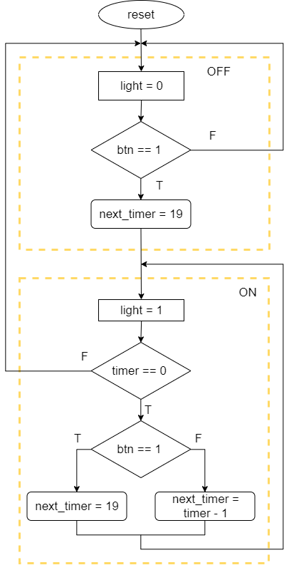
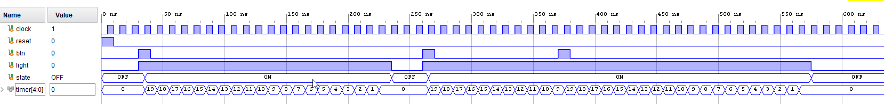
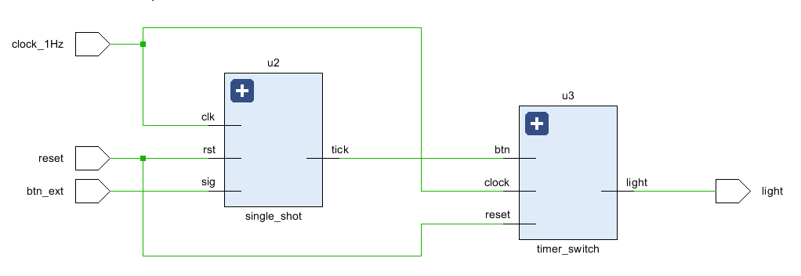
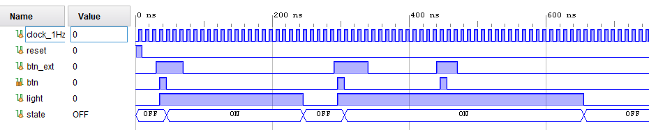
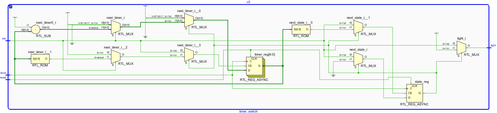
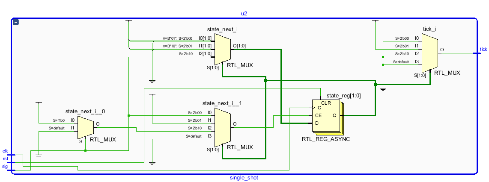

# Автомат за стълбищно осветление (или реле за време)

## timer_switch.sv

```
module timer_switch(
	input clock, // clock period is 1s
	input reset, // active high
	input btn,   // active high, duration of one clock period
  output logic light // 0 - off, 1 - on
);
```
При нарастващ фронт на входа `btn`, изходът `light` преминава във високо нивo и остава в него за 20 секунди. Ако докато `light`=1, на `btn` отново постъпи високо ниво, отброяването на 20с започва отново.



`timer_switch.sv + timer_switch.sv`


## timer_switch_top.sv
```
module timer_switch_top(
	input clock_1Hz, 
	input reset, 
	input btn_ext,
	output logic light
);
```
За правилното функциониране на схемата, сигналът `btn` трябва да остане във високо ниво за точно един период на тактовия сигнал. Формирането на единичен импулс се извършва от модула `single_shot`.



## Симулацията на цялата схема

`timer_switch_top.sv + timer_switch_top_test.sv`


## Схеми на отделните модули

`timer_switch.sv`


`single_shot.sv`

