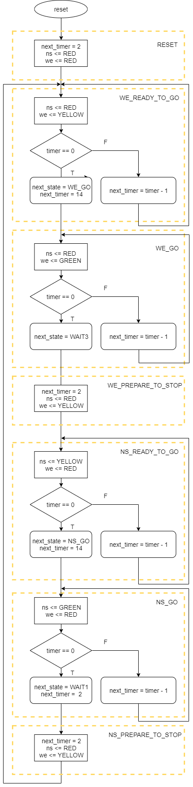

# Светофар V2



## Симулация

```

run -all
               STATE TIMER     WE     NS
               RESET     0    RED    RED
      WE_READY_TO_GO     2    RED YELLOW
      WE_READY_TO_GO     1    RED YELLOW
      WE_READY_TO_GO     0    RED YELLOW
               WE_GO    14    RED  GREEN
               WE_GO    13    RED  GREEN
               WE_GO    12    RED  GREEN
               WE_GO    11    RED  GREEN
               WE_GO    10    RED  GREEN
               WE_GO     9    RED  GREEN
               WE_GO     8    RED  GREEN
               WE_GO     7    RED  GREEN
               WE_GO     6    RED  GREEN
               WE_GO     5    RED  GREEN
               WE_GO     4    RED  GREEN
               WE_GO     3    RED  GREEN
               WE_GO     2    RED  GREEN
               WE_GO     1    RED  GREEN
               WE_GO     0    RED  GREEN
      NS_READY_TO_GO     2 YELLOW    RED
      NS_READY_TO_GO     1 YELLOW    RED
      NS_READY_TO_GO     0 YELLOW    RED
               NS_GO    14  GREEN    RED
               NS_GO    13  GREEN    RED
               NS_GO    12  GREEN    RED
               NS_GO    11  GREEN    RED
               NS_GO    10  GREEN    RED
               NS_GO     9  GREEN    RED
               NS_GO     8  GREEN    RED
               NS_GO     7  GREEN    RED
               NS_GO     6  GREEN    RED
               NS_GO     5  GREEN    RED
               NS_GO     4  GREEN    RED
               NS_GO     3  GREEN    RED
               NS_GO     2  GREEN    RED
               NS_GO     1  GREEN    RED
               NS_GO     0  GREEN    RED
  NS_PREPARE_TO_STOP     2 YELLOW    RED
      WE_READY_TO_GO     1    RED YELLOW
      WE_READY_TO_GO     0    RED YELLOW
               WE_GO    14    RED  GREEN
               WE_GO    13    RED  GREEN
               WE_GO    12    RED  GREEN
               WE_GO    11    RED  GREEN
               WE_GO    10    RED  GREEN
               WE_GO     9    RED  GREEN
               WE_GO     8    RED  GREEN
               WE_GO     7    RED  GREEN
               WE_GO     6    RED  GREEN
               WE_GO     5    RED  GREEN
               WE_GO     4    RED  GREEN
               WE_GO     3    RED  GREEN
               WE_GO     2    RED  GREEN
               WE_GO     1    RED  GREEN
               WE_GO     0    RED  GREEN
      NS_READY_TO_GO     2 YELLOW    RED
      NS_READY_TO_GO     1 YELLOW    RED
      NS_READY_TO_GO     0 YELLOW    RED
               NS_GO    14  GREEN    RED
               NS_GO    13  GREEN    RED
               NS_GO    12  GREEN    RED
               NS_GO    11  GREEN    RED
               NS_GO    10  GREEN    RED
               NS_GO     9  GREEN    RED
               NS_GO     8  GREEN    RED
               NS_GO     7  GREEN    RED
               NS_GO     6  GREEN    RED
               NS_GO     5  GREEN    RED
               NS_GO     4  GREEN    RED
               NS_GO     3  GREEN    RED
               NS_GO     2  GREEN    RED
               NS_GO     1  GREEN    RED
               NS_GO     0  GREEN    RED
  NS_PREPARE_TO_STOP     2 YELLOW    RED
      WE_READY_TO_GO     1    RED YELLOW
      WE_READY_TO_GO     0    RED YELLOW
               WE_GO    14    RED  GREEN
               WE_GO    13    RED  GREEN
               WE_GO    12    RED  GREEN
               WE_GO    11    RED  GREEN
               WE_GO    10    RED  GREEN
               WE_GO     9    RED  GREEN
               WE_GO     8    RED  GREEN
               WE_GO     7    RED  GREEN
               WE_GO     6    RED  GREEN
               WE_GO     5    RED  GREEN
               WE_GO     4    RED  GREEN
               WE_GO     3    RED  GREEN
               WE_GO     2    RED  GREEN
               WE_GO     1    RED  GREEN
               WE_GO     0    RED  GREEN
      NS_READY_TO_GO     2 YELLOW    RED
      NS_READY_TO_GO     1 YELLOW    RED
      NS_READY_TO_GO     0 YELLOW    RED
               NS_GO    14  GREEN    RED
               NS_GO    13  GREEN    RED
```
