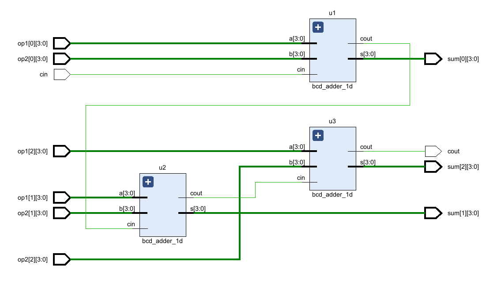
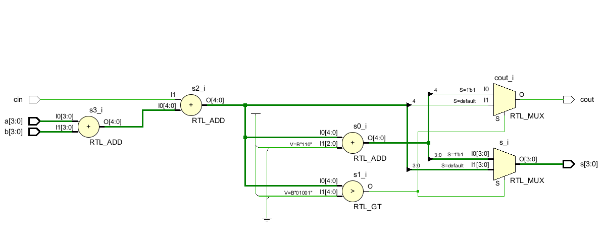
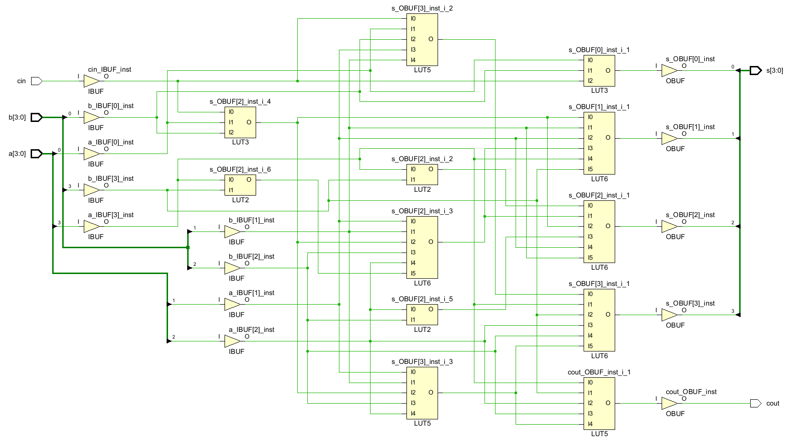

# Суматор на BCD числа

## Задача 1

Да се разработи модел на едноразряден BCD (binary-coded-decimal) суматор.  Използва се т.нар.  BCD 8421 кодиране на цифрите:
```
Цифра	BCD
0		0000
1		0001
2		0010
3		0011
4		0100
5		0101
6		0110
7		0111
8		1000
9		1001
```
Използвайте интерфейсното описание дадено във файла [bcd_adder_1d.sv](bcd_adder_1d.sv)
За верифициране на модела използвайте теста [bcd_adder_1d_test.sv](bcd_adder_1d_test.sv)

Моделът събира BCD цифрите `a` и `b` заедно с входния пренос `cin`. 
Резултатът е сумата `s` и изходният пренос `cout`. 

По-долу са дадени резултатите от симулацията на завършения модел:
```
run -all
0 + 0 + 0 = 00
0 + 0 + 1 = 01
0 + 1 + 0 = 01
1 + 0 + 0 = 01
1 + 1 + 0 = 02
2 + 2 + 0 = 04
2 + 3 + 0 = 05
3 + 2 + 0 = 05
1 + 1 + 1 = 03
2 + 2 + 1 = 05
2 + 3 + 1 = 06
3 + 2 + 1 = 06
5 + 5 + 0 = 10
5 + 5 + 1 = 11
7 + 8 + 0 = 15
8 + 7 + 1 = 16
9 + 8 + 0 = 17
9 + 9 + 0 = 18
9 + 9 + 1 = 19
```

## Задача 2

Използвайте разработеният в предишната задача едноцифрен BCD суматор за да направите структурен модел на три-цифрен BCD суматор. Схемата на суматора е дадена на следната фигура.



Използвайте интерфейсното описание дадено във файла [bcd_adder_3d.sv](bcd_adder_3d.sv)

За верифициране на модела използвайте теста [bcd_adder_3d_test.sv](bcd_adder_3d_test.sv)

По-долу са дадени резултатите от симулацията на завършения модел:
```
run -all
002 + 002 + 0 = 0004
000 + 000 + 0 = 0000
000 + 000 + 1 = 0001
999 + 000 + 1 = 1000
567 + 285 + 0 = 0852
567 + 285 + 1 = 0853
999 + 999 + 1 = 1999
```

## Приложения

На фигурите са показани схемите получени в резултат на синтеза на модела [bcd_adder_1d.sv](bcd_adder_1d.sv) посредством Xilinx Vivado.



