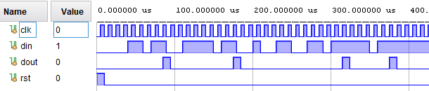
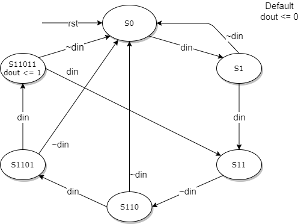

# Краен автомат за разпознаване на последователност 11011

## Указания
Моделите се намират в GitHub проекта https://github.com/vtchoumatchenko/PCIS в директория homework\fsm-sequence-11011.

Използвайте Clone or download за да копирате целият проект.

## Задание

Да се разработи SystemVerilog модел на краен автомат за разпознаване на последователноста 11011. Данните се подават последователно на входа din. При откриване на последователност 11011, на изхода dout се изработва 1 за един период на тактовия сигнал.

Диаграмата на състоянията на автомата е дадена на следната фигура:

Забележка: Поставената задача може да се реализира с различни схеми (напр. преместващ регистър и декодер). Темата на тази домашна работа е “краен автомат”, затова само краен автомат се приема за решение.