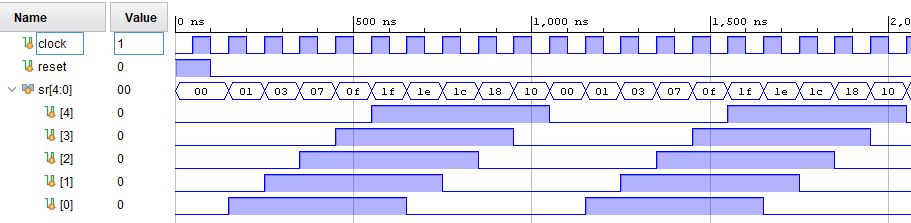
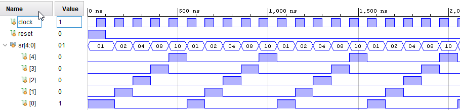

# Преместващи регистри

## Задача 1
Симулирайте модула shift_reg_test и се уверете, че той работи като брояч на Джонсън

## Задача 2
Променете моделът от предишната задача, така че да се получи ефект на "бягаща светлина":

## Задача 3
Променете моделът от предишната задача, така че да се получи ефектът показан на фигурата:

