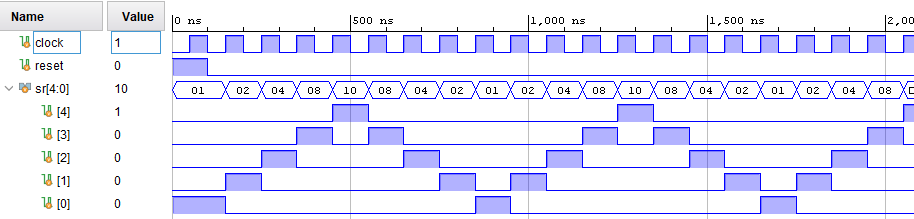

# Преместващи регистри

## Задача 1
Симулирайте модула shift_reg_test и се уверете, че той работи като брояч на Джонсън


```
00000000
00000001
00000011
00000111
00001111
00011111
00111111
01111111
11111111
11111110
11111100
11111000
11110000
11100000
11000000
10000000
00000000
00000001
00000011
00000111
00001111
00011111
00111111
01111111
11111111
11111110
11111100
11111000
11110000
11100000
11000000
10000000
00000000
```

## Задача 2
Променете моделът от предишната задача, така че да се получи ефект на "бягаща светлина":


```
00000001
00000010
00000100
00001000
00010000
00100000
01000000
10000000
00000001
00000010
00000100
00001000
00010000
00100000
01000000
10000000
00000001
00000010
00000100
00001000
00010000
00100000
01000000
10000000
00000001
00000010
00000100
00001000
00010000
00100000
01000000
10000000
00000001
```

## Задача 3
Променете моделът от предишната задача, така че да се получи ефектът показан на фигурата:



```
00000001
00000010
00000100
00001000
00010000
00100000
01000000
10000000
01000000
00100000
00010000
00001000
00000100
00000010
00000001
00000010
00000100
00001000
00010000
00100000
01000000
10000000
01000000
00100000
00010000
00001000
00000100
00000010
00000001
00000010
00000100
00001000
00010000
```