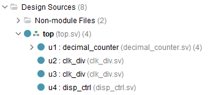
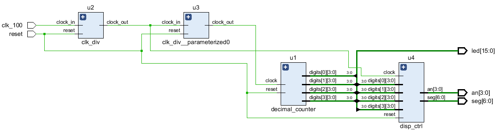

# Десетичен брояч

## Задача 1

Да се разработи модел на брояч от 0 до 9. 
Използвайте интерфейсното описание дадено във файла `decimal_counter_1digit.sv`
За верифициране на модела използвайте теста `decimal_counter_1digit_test.sv`

По-долу са дадени примери на резултатите от симулацията.
```
run -all
x  x
0  0
0  1
0  2
0  3
0  4
0  5
0  6
0  7
0  8
1  9
0  0
$finish called at time ...
```


## Задача 2
На базата за разработеният в задача 1 модел `decimal_counter_1digit`, създайте четири-разряден десетичен брояч. Състоянието на брояча се променя от 0000 до 9999. 
Използвайте интерфейсното описание дадено във файла `decimal_counter.sv`
За верифициране на модела използвайте теста `decimal_counter_test.sv`

По-долу са дадени примери на резултатите от симулацията.
```
run -all
xxxx
0000
0001
0002
...
...
9997
9998
9999
0000
$finish called at time ...
```
## Задача 3
Създайте Vivado проект за експериментална проверка на моделът decimal_counter.
Използвайте файловете от директория `/labs/decimal-counter/src/`.
Експерименталната платка е Basys 3, с FPGA xc7a35tcpg236-3.

Изберете модулът `top` за начало на йерархията на проекта:



Схемата на целият проект е дадена на следната фигура:


Генерирайте файл за програмиране на FPGA и го заредете в експерименталната платка Basys 3.