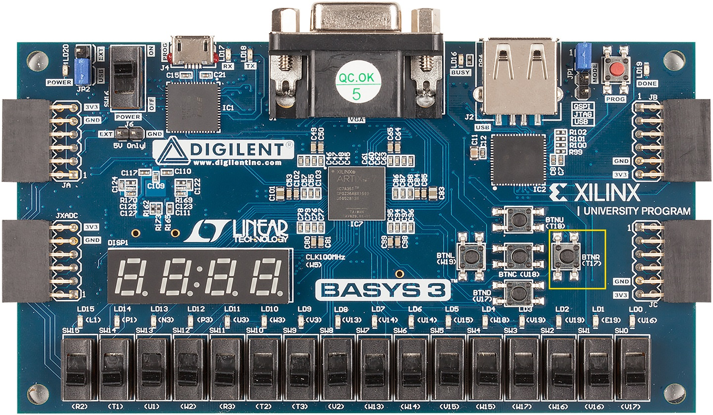
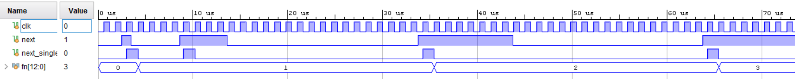
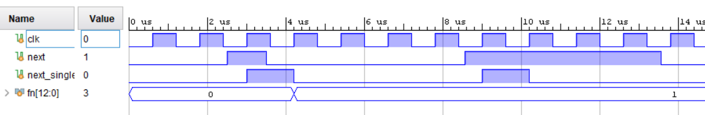

# ПЦИС Лабораторна работа - ред на Фибоначи


## Задача 1

Създайте проект в Xilinx Vivado. Изберете ИС xc7a35tcpg236-1.

Добавете всички файлове с разширение `.sv` и `Basys3_Master.xdc`


Симулирайте модула `fibonacci_test`


Генерирайте файл за програмиране на FPGA схемата и го заредете в експерименталната платка

## Задача 2

Променете моделът от предишната задача, така че всяко следващо число от реда на Фибоначи да се генерира след натискане на бутон. Използвайте бутонът btnR.



На следнаа симулация сигналът next се формира от бутона btnR, a next_single се изработва от next след синхронизация с тактовия сигнал. Тестът се намира в fibonacci_next_test.sv





Схемата за синхронизация и израбоване на единичен импулс е даденa в sync.sv

```verilog
module sync(
	input din, reset, clk, 
	output dout
);

	logic [1:0] tmp;

	always_ff @ (posedge clk, posedge reset)
		if(reset) 
			tmp <= '0;
		else 
			tmp <= {tmp[0], din};

	assign dout = ~tmp[1] & tmp[0];

endmodule
```