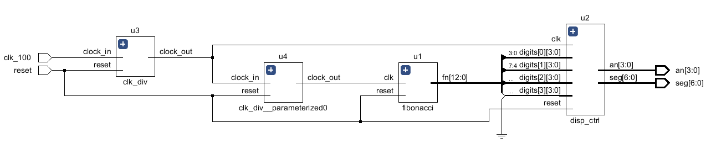
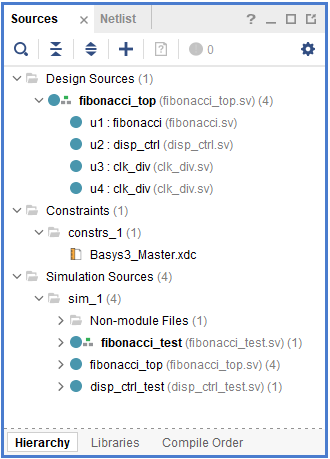
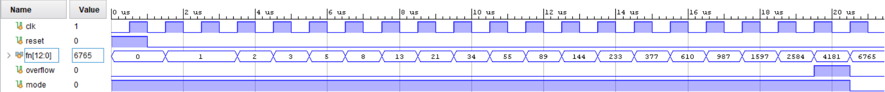

# ПЦИС Лабораторна работа - ред на Фибоначи

## Задача 1

Създайте проект в Xilinx Vivado. Изберете ИС xc7a35tcpg236-1.

Добавете всички файлове с разширение `.sv` и `Basus3_Master.xdc`

Симулирайте модула `fibonacci_test`

Генерирайте файл за програмиране на FPGA схемата и го заредете в експерименталната платка

## Задача 2

Променете моделът от предишната задача, така че всяко следващо число от реда на Фибоначи да се генерира след натискане на бутон.
