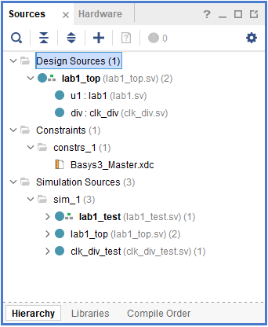
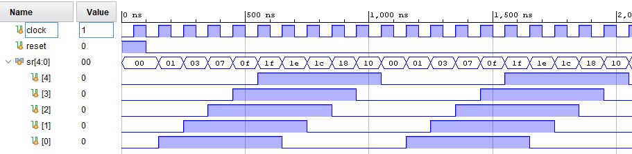
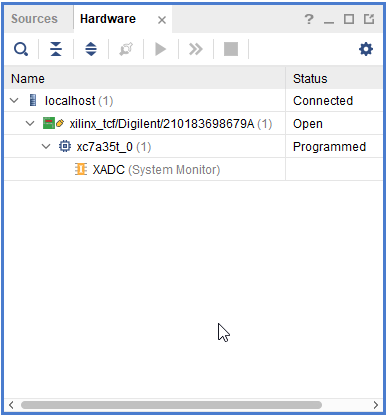
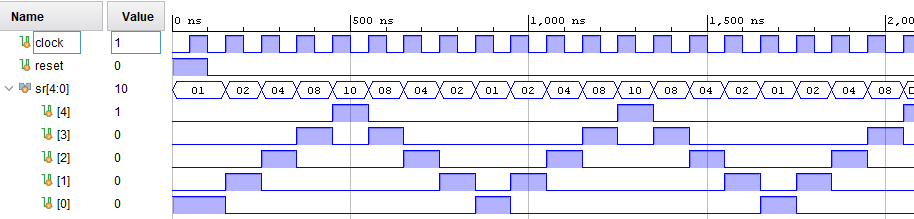

# ПЦИС Лабораторна работа 1

## Задача 1

Създайте проект в Xilinx Vivado

Добавете файловете `lab1_top.sv, lab1.sv, clk_div.sv, clk_div_test.sv и Basus3_Master.xdc`

Симулирайте модула lab1_test

Генерирайте файл за програмиране на FPGA схемата и го заредете в експерименталната платка

## Задача 2

Променете моделът от предишната задача, така че да се получи ефектът показан на следната фигура

Генерирайте файл за програмиране на FPGA схемата и го заредете в експерименталната платка

## Задача 3

Променете моделът от предишната задача, така че да се получи ефектът показан на следната фигура

Генерирайте файл за програмиране на FPGA схемата и го заредете в експерименталната платка

