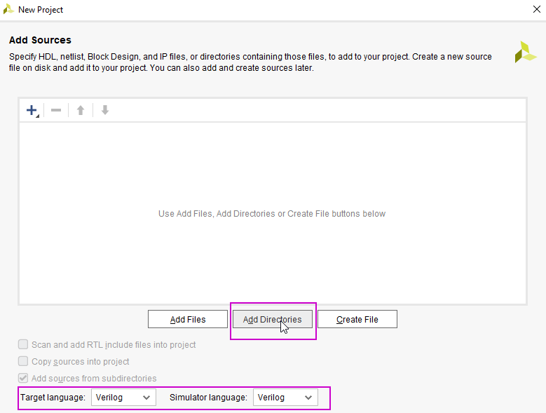
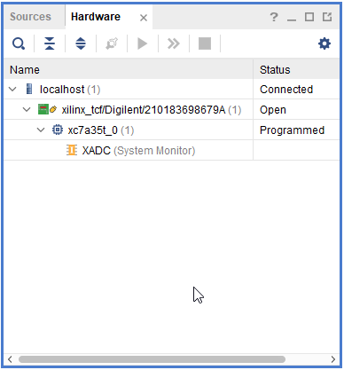

# ПЦИС Лабораторна работа 1

## Задача 1

1.1 Създайте проект в Xilinx Vivado: File > Project > new. 


Добавете файловете от директория `\labs\shift-register\src`



В зависимост от платката, която ползвате, изберете съответния constraints file. Той дефинира съответствие между имена на сигнали и изводите на FPGA ИС.

| платка | Basys 3 | Zybo |
| --- | --- | --- |
| FPGA | xc7a35tcpg236-1 | xc7z010clg400-1 |
| LEDs | 16 | 4 |
| Constraints file | Basys3_Master.xdc | Zybo-Master.xdc |


В зависимост от платката, която ползвате, изберете съответния FPGA чип (виж таблицата по-горе).


Структурата на създаденият проект трябва да е подобна на дадената по-долу:


1.2 В зависимост от броя на светодиодите налични на платката, която ползвате, променете файла `lab1_top.sv`.

```sv
module lab1_top (
  input clk_100,
  input reset,
  output [3:0] led
  );

  logic clkock;

  lab1a #(.WIDTH(4)) u1 (.sr(led), .*);

  clk_div #(.SCALE(100_000_000/16)) div (
    .clock_in(clk_100),
    .clock_out(clock),
    .reset(reset)
  );
```

1.3 Симулирайте модула lab1_test


1.4 Генерирайте файл за програмиране на FPGA схемата и го заредете в експерименталната платка




## Задача 2

Променете моделът от предишната задача, така че да се получи ефектът показан на фигурата:


Генерирайте файл за програмиране на FPGA схемата и го заредете в експерименталната платка

## Задача 3

Променете моделът от предишната задача, така че да се получи ефектът показан на фигурата:


Генерирайте файл за програмиране на FPGA схемата и го заредете в експерименталната платка

